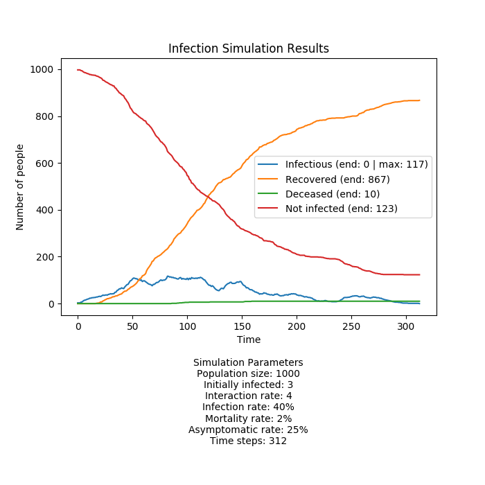

# Infectious Disease Simulator

The intent of this project is to run simple simulations of how an infectious disease spreads through a population. It uses NumPy for efficiency, PyGame for visualization, and PySimpleGUI for adjusting the starting parameters.

The [infect_sim.py](infect_sim.py) file houses the code necessary for the simulations.

A simulation can be visualized with easily adjustable GUI inputs by running the [run_sim.py](run_sim.py) script. The initial environmental parameters are meant to simulate a COVID-19 outbreak.

Example of the GUI.

Example of a visualized simulation in progress.

Black squares are uninfected people. Light green squares are currently infectious people. The darker green circle surrounding them show the cells in the environment that represent their interaction rate and any uninfected people in these darker green squares may also become infected. The blue squares are recovered people who are no longer infectious or able to contract the disease. Red squares are deceased people.

After the visualization is done running a time series graph of the simulation is displayed.

To run a simulation with no visualization and only see the results graphed afterwards, run the [basic_sim.py](basic_sim.py) script. The preset parameters are set to mimic a COVID-19 outbreak.

## Overview of how a simulation is run

### Setting Up the Environment
The Environment class creates an NumPy 2D array to act as an environment for a population to randomly move around in. The environment is populated randomly with integers representing the people in the population. Each integer is associated with a Person instance in a dictionary to keep track of their state. The first n number of people put into the environment are infected where n is the initial number of infected people.

Each Person instance is assigned a number of days (time steps) until they recover from the infection based on a defined normal distribution and also whether they will be asymptomatic based on a predefined probability. If they are asymptomatic their interaction rate will likely be higher due to not knowing that they are sick. Conversely, if they are symptomatic then their interaction rate will be 0 or 1, representing their attempt to self isolate.

### Running the Simulation
At each time step during the simulation each person moves one step from their current position with the edges of the environment wrapping around. If a person is boxed in by other people they will stay put for that time step. If a person is currently infectious there is a chance they will infect the other people immediately around them based on their own interaction and the defined infection rate.

After this there is a cleanup phase where each person is checked to see if they have reached the number of days it takes for them to either recover or die. If they recover they are no longer infectious and are immune to reinfection and if they die they are removed from the simulation.

The simulation is run until there are no more infectious people left.
